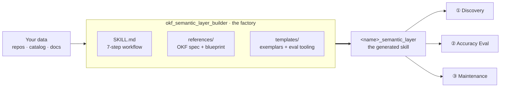
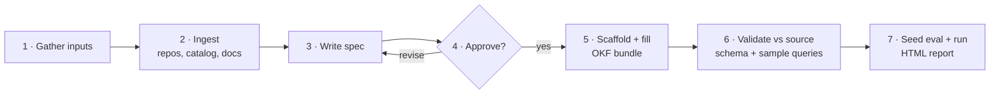
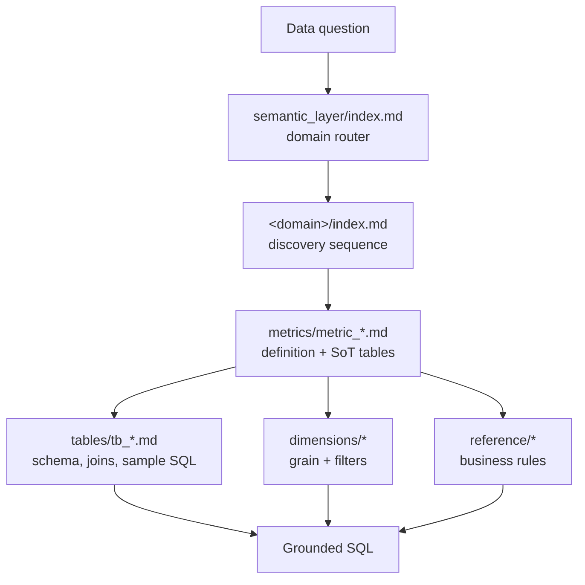

<div align="center">

# 🧭 OKF Semantic-Layer Builder

**A Claude Code skill that turns a data estate into a grounded, agent-navigable semantic layer — built on Google's open, vendor-neutral [Open Knowledge Format](https://cloud.google.com/blog/products/data-analytics/how-the-open-knowledge-format-can-improve-data-sharing).**

*Stop letting agents guess at your tables. Give them a curated map.*


</div>

---

## 📑 Table of Contents

- [1. Overview](#1-overview)
  - [(a) Open Knowledge Format](#a-open-knowledge-format)
  - [(b) A head start, not a finish line](#b-a-head-start-not-a-finish-line)
- [2. The Builder Workflow & Architecture Design](#2-the-builder-workflow--architecture-design)
- [3. Architecture of the Generated Semantic Layer](#3-architecture-of-the-generated-semantic-layer)
- [4. Key Features of the Generated Semantic Layer](#4-key-features-of-the-generated-semantic-layer)
- [5. How to Install](#5-how-to-install)
- [6. Layout of This Folder](#6-layout-of-this-folder)

---

## 1. Overview

**OKF Semantic-Layer Builder is a *meta-skill*: a skill that builds skills.** Point it at a warehouse
repo, a dbt project, a data catalog, or a pile of documentation, and it generates a self-contained
**semantic-layer skill** — a structured, navigable library of your domains, datasets, tables, metrics,
dimensions, and business rules that lets an AI agent resolve *what data to use* and write **correct,
grounded SQL** instead of hallucinating column names and metric math.

It exists because the hard part of natural-language-to-SQL is not the SQL — it is the **context**:
knowing which table is the source of truth, how a metric is *really* defined, what grain a question
implies, and which business rules silently apply. This skill captures that context once, in a portable
open format, so every future agent query starts from ground truth.

### (a) Open Knowledge Format

[**Open Knowledge Format (OKF)**](https://github.com/GoogleCloudPlatform/knowledge-catalog/tree/main/okf)
is Google Cloud's vendor-neutral standard for representing organizational knowledge as **a directory of
markdown files with YAML frontmatter — one file per concept.** It is deliberately minimal: agree on a
tiny interoperability surface, leave everything else to the producer.

| OKF principle | What it means here |
| :-- | :-- |
| **Markdown + YAML frontmatter** | Frontmatter holds the few fields worth querying (`type`, `title`, `tags`, `timestamp`); the body holds schemas, formulas, and sample queries. `type` is the only required field. |
| **File path = concept identity** | `sales/tables/fct_orders.md` *is* the concept `sales/tables/fct_orders`. No separate IDs. |
| **`index.md` = progressive disclosure** | An agent reads a small index, follows links down to exactly the concept it needs, and ignores the rest — keeping context lean and answers grounded. |
| **Cross-links form a graph** | Concepts link with ordinary markdown links (`[fct_orders](/sales/tables/fct_orders.md)`), so joins, lineage, and metric→table relationships are navigable. |
| **Reserved files** | `index.md` and `log.md` are frontmatter-less and never concept docs; the bundle root may declare `okf_version: "0.1"`. |

Because the output is *just markdown and files*, it is readable in any editor, renderable on GitHub,
diffable in git, and consumable by any agent — no proprietary catalog or SDK required.

### (b) A head start, not a finish line

> **This builder gets you to a working OKF semantic layer in minutes — but a semantic layer is only as
> good as the context inside it.** The generator produces a strong, consistent, OKF-conformant scaffold.
> Its eventual *performance* depends on the accuracy of each definition, the coverage of your metrics,
> and the correctness of every sample query you curate on top of that scaffold.

**After the initial generation, it is highly recommended to:**

1. **Review every markdown file** in `semantic_layer/` for accuracy and completeness — schemas, metric
   formulas, must-apply rules, join keys, and sample queries.
2. **Add as many real-world questions as possible** to `eval/test_cases/` — the questions your team
   actually asks, each with its known-correct answer and reference SQL.
3. **Repeat the Eval** until the accuracy is acceptable for your use case, fixing the layer between runs
   based on the report's misses and recommended actions.

Treat the first generation as commit #1, not the final product. The eval loop is how you converge.

---

## 2. The Builder Workflow & Architecture Design

The skill follows a **two-artifact model**. Keep them distinct: the *builder* is the factory; the
*generated skill* is the product it stamps out for your data.



The factory runs a **seven-step workflow**, with an explicit human approval gate before anything is
scaffolded and a validation gate before anything is trusted:



| Step | What happens |
| :-- | :-- |
| **1 · Gather inputs** | Skill name, codebase/repos, data-catalog access (or explicit consent to probe with `SELECT * … LIMIT 1`), reference docs, and test cases. Anything already provided is skipped. |
| **2 · Ingest** | Read-only extraction of tables, columns, metric definitions, dimensions, join keys, grain, and rules. Subagents may explore domains in parallel to keep context clean. |
| **3 · Write spec** | Propose the domains discovered, where each table/metric/dimension lands, and which table is the **Source of Truth** for each metric. |
| **4 · Approve** | **Hard gate.** You review and approve the spec; domain boundaries and SoT calls propagate into every file. |
| **5 · Scaffold + fill** | Write the OKF bundle (frontmatter + required sections per concept), copy the self-contained eval tree, and write the generated `SKILL.md`. |
| **6 · Validate vs source** | For each table, confirm the written schema with `SELECT * … LIMIT 1`; run **every** embedded sample query. Drift and broken queries are fixed before the layer is trusted. |
| **7 · Seed eval + run** | Convert your test cases, run the accuracy eval, and produce the HTML report for review. |

**Design rationale.** Discovery is *metric-centric* because data questions are overwhelmingly about
measures; the bundle is *many small linked files* rather than one monolith because progressive
disclosure is what keeps an agent's working context lean and its answers grounded; and the builder
*never writes to your systems* — the only database action is an optional, consented `LIMIT 1` probe.

---

## 3. Architecture of the Generated Semantic Layer

Every generated skill is a complete, self-contained OKF bundle plus an eval harness. **Full structure:**

```
<name>_semantic_layer/
├── SKILL.md                                # 3 workflows: discovery · eval · maintenance
│
├── semantic_layer/                         # the OKF bundle (knowledge as a living wiki)
│   ├── index.md                            # ROOT router: okf_version + domain map + FALLBACK mechanics
│   ├── log.md                              # OKF change history (appended by the maintenance workflow)
│   │
│   ├── <domain_a>/                         # one folder per business domain (e.g. sales/)
│   │   ├── index.md                        # domain scope + the DISCOVERY SEQUENCE for this domain
│   │   ├── datasets/
│   │   │   ├── index.md                    # which datasets exist + when to use which
│   │   │   ├── db_<name>.md                # dataset/database: schema (tables), grain, connection notes
│   │   │   └── db_<name2>.md
│   │   ├── tables/
│   │   │   ├── index.md                    # which tables exist + when to use which
│   │   │   ├── tb_<name>.md                # grain · schema · joins · lineage · metrics(SoT) · sample queries
│   │   │   └── tb_<name2>.md
│   │   ├── metrics/
│   │   │   ├── index.md                    # which metrics exist + when to use which
│   │   │   ├── metric_<name>.md            # definition (num · denom · rules) · grain · SoT tables & queries
│   │   │   └── metric_<name2>.md
│   │   ├── dimensions/
│   │   │   ├── index.md                    # which dimensions exist + when to use which
│   │   │   ├── dimension_<name>.md         # definition · expected values · source tables & sample queries
│   │   │   └── dimension_<name2>.md
│   │   └── reference/
│   │       ├── index.md                    # which references exist + when to use which
│   │       ├── reference_<name>.md         # business rules / product / competitor context (cross-linked)
│   │       └── reference_<name2>.md
│   │
│   └── <domain_b>/                         # additional domains (product/, billing/, …) share the shape
│       └── …
│
└── eval/                                   # self-contained accuracy harness (copied verbatim by the builder)
    ├── test_cases/
    │   ├── test_case_<name>.md             # question · expected answer · expected query
    │   └── test_case_<name2>.md
    ├── eval_reports/
    │   └── <timestamp>.html                # generated accuracy reports
    └── tools/
        ├── eval-harness.md                 # the two-subagent answer→grade protocol
        ├── generate_report.py              # deterministic HTML report renderer (stdlib only)
        └── report_template.html            # Anthropic-styled report shell
```

**How an agent traverses it** — Workflow 1 descends only the path it needs:



Every folder carries an `index.md` so the agent is always told *which file to open and when* — it never
has to read the whole bundle. Concepts cross-link with absolute bundle-relative paths
(`/<domain>/tables/tb_<name>.md`), turning the directory into a navigable knowledge graph.

---

## 4. Key Features of the Generated Semantic Layer

- 🧭 **Progressive disclosure** — `index.md` routers at every level mean an agent loads only the
  concepts a question needs, keeping context small and answers fast.
- 🎯 **Metric-centric grounding** — every metric carries its canonical definition (numerator,
  denominator, must-apply rules) and links to **Source-of-Truth tables with runnable sample queries**,
  including at least one *aggregated* table (fast reporting) and one *granular* table (deep dives).
- 🔗 **OKF-native knowledge graph** — concepts cross-link with markdown links, so joins, lineage, and
  metric→table relationships are explicit and traversable (and render in the OKF graph visualizer).
- 🛡️ **Source-of-Truth discipline** — each table declares the metrics it is authoritative for
  (`sot_for`), so agents never compute a number from the wrong place.
- 📊 **Built-in accuracy eval** — a two-subagent harness answers then grades your test cases on a
  **three-tier scale** (correct ≤±2% · partial ±2–5% · incorrect) and renders an Anthropic-styled HTML
  report with per-case miss explanations and recommended actions.
- ♻️ **Self-maintaining (living wiki)** — the maintenance workflow adds or updates a single concept in
  place, re-indexes affected `index.md` files, and appends `log.md` — no full rebuild required.
- ✅ **Validated against source** — generated schemas and sample queries are checked against the live
  warehouse before the layer is trusted.
- 🪶 **Self-contained & portable** — pure markdown plus a single stdlib-only Python script; no
  dependencies, no services, drops into any Claude Code runtime.
- 🚧 **Tiered fallback** — when a question falls outside coverage, the layer escalates gracefully
  (suggest nearest concept → optional catalog probe → recommend extending the layer) instead of guessing.

---

## 5. How to Install

This folder ships the skill under [`skill/`](./skill). Copy it into your Claude Code skills directory
under the skill's name:

```bash
# from a clone of this repository
cp -r OKF_Semantic_Layer_Builder/skill ~/.claude/skills/okf_semantic_layer_builder
```

> On Windows (PowerShell):
> ```powershell
> Copy-Item -Recurse OKF_Semantic_Layer_Builder\skill "$env:USERPROFILE\.claude\skills\okf_semantic_layer_builder"
> ```

Then start a Claude Code session and invoke it:

```
/okf_semantic_layer_builder
```

…or simply ask Claude to **"build a semantic layer for &lt;your data&gt;."** The skill will walk you
through the seven-step workflow, pausing for your approval on the spec before it writes anything.

**Requirements:** Claude Code, Python 3.8+ (for the eval report renderer). A SQL/catalog tool or MCP is
recommended so the builder can validate schemas and the eval can execute generated queries.

---

## 6. Layout of This Folder

```
OKF_Semantic_Layer_Builder/
├── README.md                                   # you are here
└── skill/                                      # the okf_semantic_layer_builder skill
    ├── SKILL.md                                # the 7-step builder (factory) workflow
    ├── references/
    │   ├── okf-spec.md                         # OKF v0.1 conventions the generated files follow
    │   └── output-skill-blueprint.md           # the exact anatomy of a generated skill
    └── templates/                              # few-shot exemplars the builder copies + adapts
        ├── generated_SKILL.md                  # the 3-workflow SKILL.md stamped into each new skill
        ├── semantic_layer/                     # a fully-worked `sales` domain (the quality anchor)
        │   ├── index.md                        # root domain router + fallback mechanics
        │   └── sales/
        │       ├── index.md                    # domain scope + discovery sequence
        │       ├── datasets/
        │       │   ├── index.md
        │       │   └── orders_db.md
        │       ├── tables/
        │       │   ├── index.md
        │       │   ├── fct_orders.md           # granular SoT — one row per order line
        │       │   └── agg_sales_daily.md      # aggregated SoT — day x segment
        │       ├── metrics/
        │       │   ├── index.md
        │       │   └── gross_revenue.md
        │       ├── dimensions/
        │       │   ├── index.md
        │       │   └── customer_segment.md
        │       └── reference/
        │           ├── index.md
        │           └── revenue_recognition.md
        └── eval/                               # self-contained accuracy harness
            ├── test_cases/
            │   └── test_case_example.md
            ├── eval_reports/
            │   └── .gitkeep
            └── tools/
                ├── eval-harness.md             # two-subagent answer->grade protocol
                ├── generate_report.py          # deterministic HTML report renderer
                └── report_template.html        # Anthropic-styled report shell
```

---

<div align="center">

**Built on the [Open Knowledge Format](https://github.com/GoogleCloudPlatform/knowledge-catalog/tree/main/okf) · for [Claude Code](https://claude.com/claude-code).**

*The generator is the easy part. The curation and the eval loop are where accuracy is won.*

</div>
